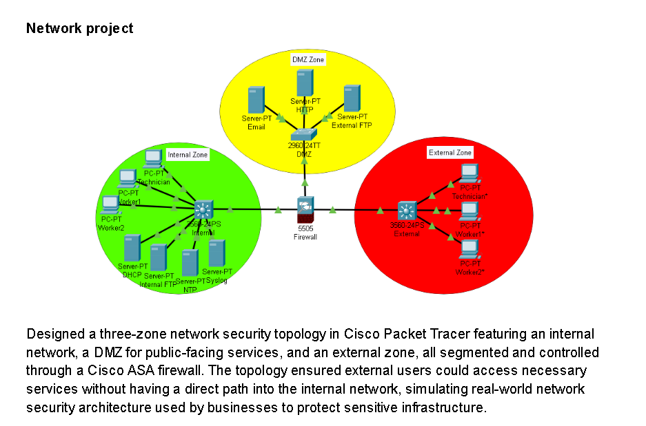

# Network Security Topology

## Objective

This project involved designing and implementing a secure three-zone network topology in Cisco Packet Tracer. The goal was to simulate real-world network security architecture used by businesses to protect sensitive infrastructure by segmenting traffic across internal, DMZ, and external zones.

---

## Tools & Technologies

| Tool | Purpose |
|---|---|
| Cisco Packet Tracer | Network simulation and topology design |
| Cisco ASA 5505 Firewall | Zone segmentation and traffic control |
| Cisco 3560 Layer 3 Switch | Internal and external network switching |
| Cisco 2960 Switch | DMZ zone switching |
| VLANs & ACLs | Traffic isolation and access control |
| OSPF & EIGRP | Dynamic routing protocols |

---

## Network Design

Designed a three-zone network security topology featuring:

- **Internal Zone** — Houses internal workstations (Technician, Worker1, Worker2), DHCP server, Internal FTP, NTP, and Syslog servers, isolated from external access
- **DMZ Zone** — Hosts public-facing services including HTTP, Email, and External FTP servers, accessible to external users without exposing the internal network
- **External Zone** — Simulates outside users and devices attempting to access services, controlled through the firewall

All zones are segmented and controlled through a **Cisco ASA 5505 firewall**, ensuring external users can only reach DMZ services and have no direct path into the internal network.

---

## What I Did

- Designed and implemented a secure three-zone network topology using Cisco Packet Tracer, integrating VLANs and ACLs to isolate and protect data traffic
- Configured a Cisco ASA firewall to enforce zone-based security policies between internal, DMZ, and external segments
- Verified and optimized routing, IP addressing, and device communication through OSPF and EIGRP configurations
- Simulated real-world enterprise network security architecture to reduce unauthorized access risk

---

## Skills Demonstrated

- Network topology design and segmentation
- Cisco ASA firewall configuration
- VLAN and ACL implementation
- Dynamic routing (OSPF, EIGRP)
- DMZ architecture and zone-based security
- Cisco Packet Tracer simulation

---

## Outcome

Successfully built a functional three-zone network that mirrors enterprise security architecture, demonstrating the ability to design, segment, and secure complex network environments using industry-standard tools and protocols.
